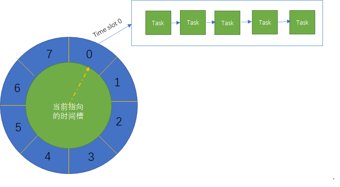

# timewheel

Pure golang implementation for timewheel.



## Usage

### base method

create timewheel

```
// 初始化时间轮
// 第一个参数为tick刻度, 即时间轮多久转动一次
// 第二个参数为时间轮槽slot数量
tw, err := timewheel.New(100*time.Millisecond, 300)
if err != nil {
    panic(err)
}

tw.Start()

```


add delay task

```
// create a task bind with key, data and  time out call back function.
t := &timewheel.Task{
    Data: map[string]int{"uid": 105626, "age": 100}, // business data
    TimeoutCallback: func(task timewheel.Task) { // call back function on time out
        // process someting after time out happened. 
        fmt.Println("time out:", task.Delay(), task.Key, task.Data, task.Elasped())
    }}

// add task and return unique task id
taskid := tw.AddTask(5*time.Second, *t) // add delay task

```

remove delay task

```
tw.Remove(taskid)
```

close time wheel

```
tw.Stop()
```
## example

[example/demo.go](example/demo.go)